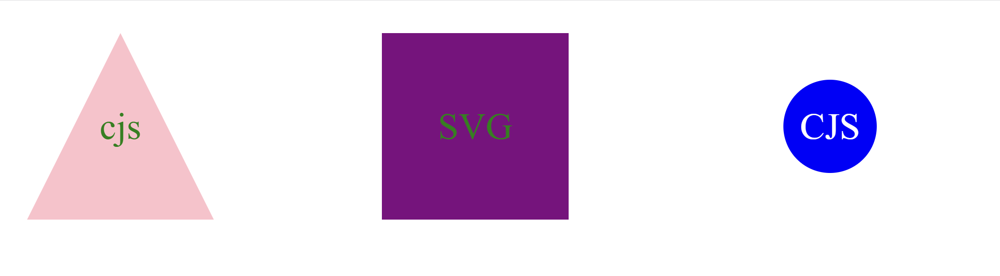

# Logo Maker

 
## Description
This command line tool uses the NPM package ‘Inquirer 8.24’ to prompt the user for choices that will design their own logo as an SVG file. The app is then tested using Jest JS to make sure the SVG file is rendered correctly when a color is chosen.
 
   ## Table of Contents 
   - [Installation](#installation)
   - [usage](#usage)
   - [License](#license)
   - [Contributing](#contributing)
   - [Tests](#tests)
   - [Questions](#questions)
 

   ## Installation Instructions
   - node, inquirer 8.2.4, and Jest
 

   ## Usage
   - Install correct packages needed.
   - Run node index.js
   - Answer the questions to generate a markdown file
   - Run npm test to test the classes being made
  
  
   
  

 
   - https://drive.google.com/file/d/1FE6_DoQUQ_ZTpoM6oFOXi90-Bw5vcd6a/view
   

   ## Contributing
   Contributions are welcome. 
   Please submit a pull request at https://github.com/cjsolis12
 
   
   ## Tests
   Run the following command to run tests:
   ```
   node index.js
   npm test
   ```
   
   ## Credits
   - https://www.npmjs.com/package/jest
   - https://www.npmjs.com/package/inquirer/v/8.2.4
   - https://developer.mozilla.org/en-US/docs/Web/SVG/Tutorial

   ## Questions
   If you have any questions, please contact me using the following information:
 
   GitHub username: https://github.com/cjsolis12
 
   Email address: cjelizondo12@gmail.com